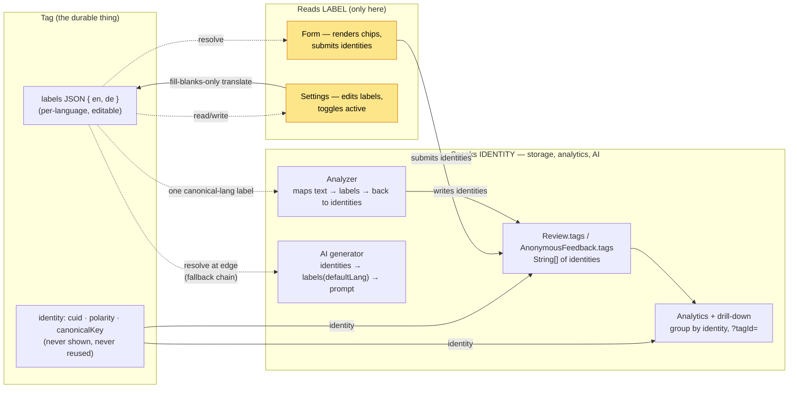
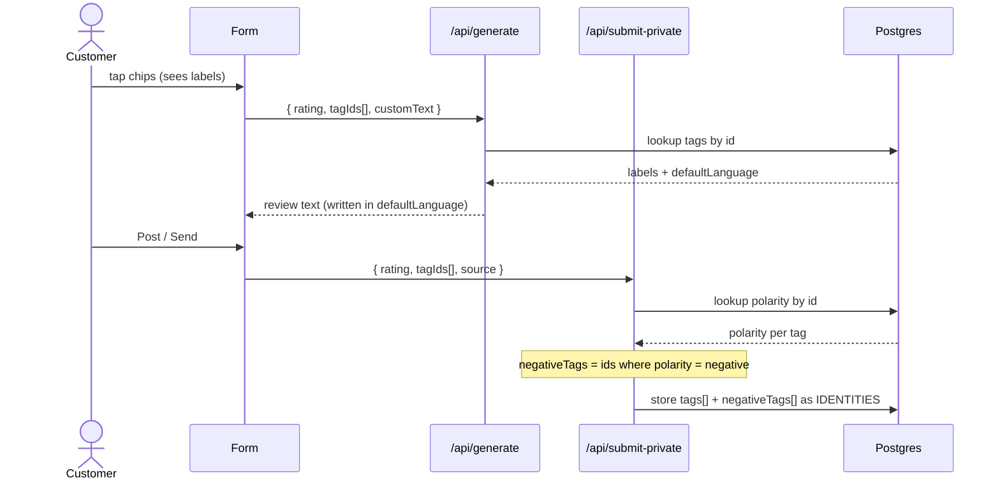

# Tag identity is separate from its display label

**Status:** accepted

> **Amendment (settings redesign):** the original "light edits only — no reorder" line is
> relaxed. The settings editor now also supports **managing supported languages** (toggle a
> language on → fill blank labels; off → hide but keep labels; the base language is
> immutable), a **multilingual welcome message** (`FormConfig.welcomeMessage` is now
> `Json {lang→text}`), and **adding per-business custom chips** via a modal (`source = custom`,
> no canonical key — created on that business's category only; the restaurant-level Taxonomy
> Template, ADR-0006, is never mutated; English required, other languages optional + blank-fill
> translated).
>
> **Removal policy** (the chip `×`): a chip **younger than 7 days (`Tag.createdAt`) AND
> referenced by no feedback** is **permanently deleted**; otherwise it is **deactivated**
> (`active` off — hidden from the form, history preserved). This keeps the never-orphan-history
> invariant while letting owners cleanly undo a just-added chip. The editor renders only active
> chips (restore UI for deactivated chips is deferred).
>
> Drag-to-reorder was tried and **removed** (it made the form tall); `Tag.order` is retained
> (seed/append order) but not user-editable for now. Still excluded: adding/removing
> **categories**. The identity-vs-label core below is unchanged.

A taxonomy tag now has a permanent **identity** (a cuid, never shown, never reused) distinct
from its **display labels** (one editable string per supported language). Storage, analytics, AI
generation, and the analyzer all operate on identity; only the form and the settings screen ever
read a label. This replaces the previous model where a tag *was* its display string
(`FeedbackCategory.positiveChips` / `negativeChips`), so renaming or translating a chip orphaned
every past review tagged to the old wording and analytics could not unify the same concept across
languages. We design it now because the app is pre-launch (seed data only) and the structure is
expensive to undo once real, live-tagged data exists. See [PRD](../prd/multilingual-tag-management.md).

## The identity / label boundary

Everything left of the dashed line speaks **identity** (cuid). Only the two shaded nodes on the
right ever touch a human-readable **label**, and labels are resolved *at the edge* — read from the
`labels` JSON for display, never stored back into history.

**How to read it:** a rename or translation only ever touches the `labels` JSON (bottom edge). It
never reaches `Review.tags`, so historical feedback stays attributed and analytics stay unified
across languages — the entire reason this design exists.

### One submission, end to end

## Decisions

- **Labels stored as a JSON map on `Tag`/`FeedbackCategory** (`{ "en": "...", "de": "..." }`), not a
  relational `TagLabel` table. At our scale (~tens of labels per business) the extra tables buy
  nothing; the analyzer's label→identity reverse lookup and the "no two active tags share a label
  per language" guardrail are cheap app-level checks.
- **The form/server contract is identities everywhere.** The form submits tag identities to both
  `/api/generate` and `/api/submit-private`; the server resolves identities → labels (in the
  business `defaultLanguage`) for the LLM and derives `negativeTags` from each tag's polarity by
  identity. One contract, one source of truth.
- **Auto-fill is fill-blanks-only**, no per-label provenance flag: translation fills only languages
  with no label and never overwrites an existing one. Renaming a working-language label does *not*
  re-propagate to translations (the owner edits those by hand). Chosen for v1 simplicity over
  honoring "author once" across renames.
- **`defaultLanguage` + `supportedLanguages` live on `FormConfig`**, not `Business` — every reader
  of language already loads `FormConfig`, and a business with no form config has no taxonomy.
- **Polarity is fixed and, in v1, immutable** (no UI to change it). Changing polarity requires the
  deferred full editor (deactivate + recreate).

## Consequences

- **The identity↔label boundary is silent.** `Review.tags` / `AnonymousFeedback.tags` keep their
  `String[]` type but change *meaning* from labels to identities. Any consumer that still treats
  them as display strings will render cuids instead of human labels rather than failing loudly —
  every reader must resolve identity→label (notably the feedback inbox, `ReviewCard`, the analytics
  zone chart, and the `feedback-by-tag` drill-down, which now takes `?tagId=`).
- **Settings save must update tags in place by identity, never delete-and-recreate** — the old
  `upsertFormConfig` delete+recreate would orphan every historical analytics reference, the exact
  failure this whole change exists to prevent.
